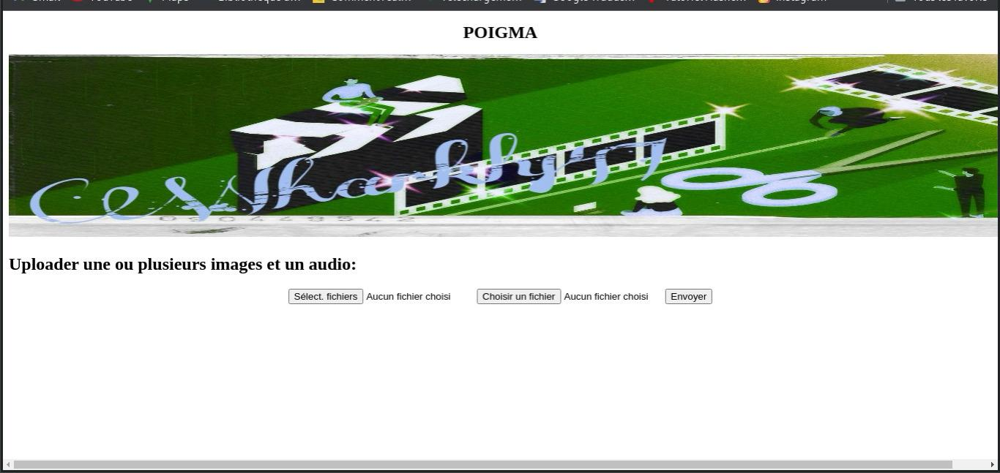
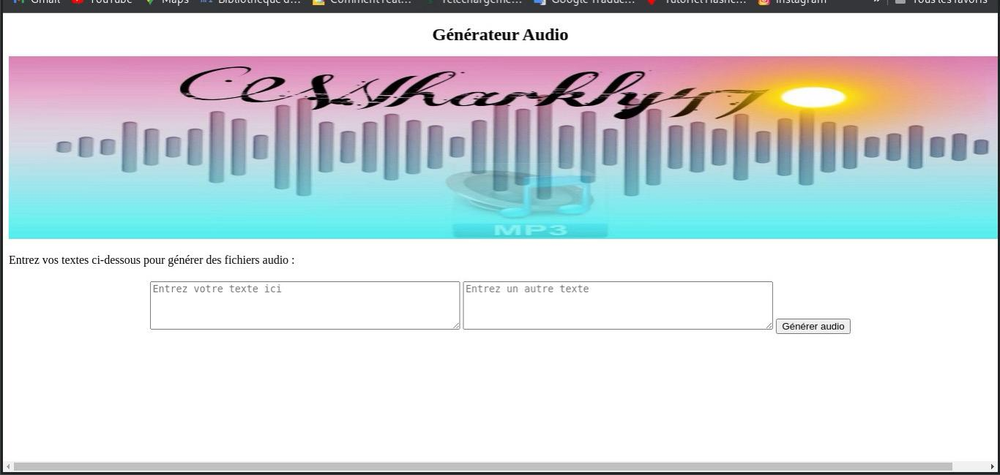
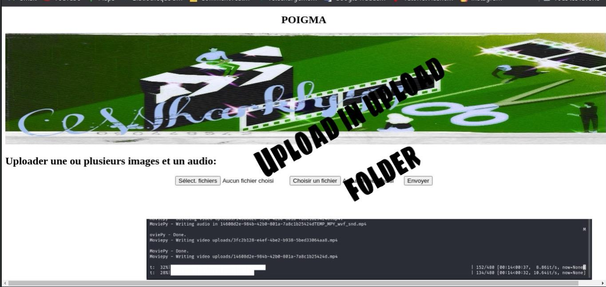

# POIGMA

POIGMA est une application web simple pour créer des vidéos à partir d'images et d'audio téléchargés par l'utilisateur.

## Fonctionnalités

- **Téléchargement d'images :** Les utilisateurs peuvent télécharger plusieurs images pour créer une vidéo.
- **Téléchargement audio :** Les utilisateurs peuvent télécharger un fichier audio pour l'ajouter à la vidéo.
- **Traitement vidéo :** Les images téléchargées sont combinées pour former une vidéo avec l'audio sélectionné.

## Utilisation

1. **Clonez le dépôt :** `git clone https://github.com/Wharkly47/POIGMA.git`
2. **Installez les dépendances :** `pip install -r requirements.txt`
3. **Lancez l'application :** `python poigma.py`
4. **Accédez à l'application :** Ouvrez votre navigateur et allez à `http://localhost:5000`

## Technologies utilisées

- Flask : Framework web utilisé pour la gestion des routes et des requêtes.
- MoviePy : Bibliothèque utilisée pour la manipulation des vidéos à partir d'images et d'audio.
- JavaScript & jQuery : Utilisés pour la gestion des requêtes AJAX et la manipulation du DOM.

## Contributeurs

- [Wharkly47](https://github.com/Wharkly47) - Développeur principal

## Contact

Pour toute question ou suggestion, contactez Wharkly47 à l'adresse wharklya@gmail.com.

